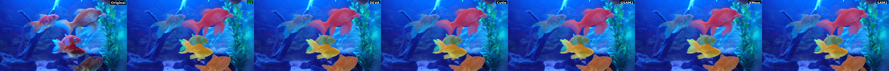
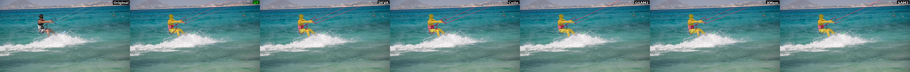
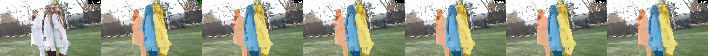
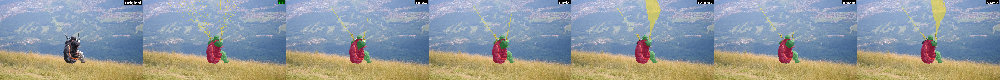
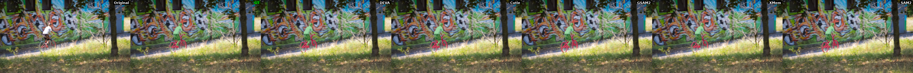
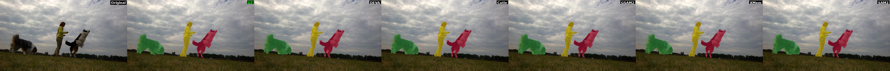

# Week 5 Report: DAVIS 2017 分割模型定量评估与对比分析

> **作者**: 刘麓琰 | **日期**: 2026-03-22

---

## 一、评估概述

对 DAVIS 2017 验证集（30 个视频序列）上的 **5 个视频目标分割模型** 进行了系统的定量评估。

### 评估指标

| 指标 | 含义 | 来源 |
|------|------|------|
| **J (Jaccard / IoU)** | 预测 mask 与 GT 的区域重叠度 | DAVIS 标准 |
| **F (Boundary F-measure)** | 预测 mask 边界与 GT 边界的精度和召回率 | DAVIS 标准 |
| **J&F** | J 和 F 的平均值，DAVIS 官方综合指标 | DAVIS 标准 |
| **TC (Temporal Consistency)** | 相邻帧预测 mask 的 IoU，衡量时序稳定性 | 项目自定义 |
| **ΔArea%** | 帧间 mask 面积变化率，衡量面积稳定性 | 项目自定义 |

---

## 二、总体定量结果

### 2.1 模型综合排名

| 排名 | Model | J | F | J&F | TC | ΔArea% | 超20%帧数 |
|:----:|-------|:-----:|:-----:|:------:|:-----:|:------:|:--------:|
| 1 | **GSAM2** | **89.50** | **92.25** | **90.87** | 79.44 | 4.41 | 45 |
| 1 | **SAM2** | **89.50** | **92.25** | **90.87** | 79.44 | 4.41 | 45 |
| 3 | Cutie | 87.78 | 90.04 | 88.91 | **79.71** | **4.06** | **27** |
| 4 | DEVA | 87.56 | 89.99 | 88.77 | 79.65 | 4.23 | 41 |
| 5 | XMem | 86.24 | 88.12 | 87.18 | 79.66 | 4.24 | 47 |

**关键发现**: GSAM2 和 SAM2 的所有指标完全一致，说明二者在 DAVIS 2017 上使用了相同的 SAM2 底层进行视频传播（GSAM2 = Grounding DINO 检测 + SAM2 分割传播，而此处评测的 SAM2 结果也使用了相同的传播流程）。

---

## 三、代表性案例分析

### 3.1 多物体场景: gold-fish（5个物体）

**场景描述**: 鱼缸中 5 条不同颜色和大小的金鱼，物体之间存在频繁遮挡。

| Model | J | F | J&F | TC |
|-------|:---:|:---:|:----:|:---:|
| GSAM2/SAM2 | **93.9** | **94.2** | **94.1** | 88.6 |
| Cutie | 93.4 | 93.3 | 93.4 | 89.0 |
| DEVA | 92.4 | 92.1 | 92.2 | **89.0** |
| XMem | 89.9 | 89.2 | 89.5 | 89.3 |



**分析**: 多物体场景下各模型表现均较好（J&F > 89），GSAM2/SAM2 以 94.1 领先。XMem 对小金鱼的分割偶有漏检，导致 J 值最低。注意小鱼（如画面左上角的鱼）面积很小，像素级指标对其权重有限。

---

### 3.2 细长物体场景: kite-surf（3个物体，含风筝线）

**场景描述**: 冲浪者 + 风筝 + 风筝线，风筝线是典型的细长结构。

| Model | J | F | J&F | TC |
|-------|:---:|:---:|:----:|:---:|
| GSAM2/SAM2 | **61.0** | **81.4** | **71.2** | 41.5 |
| DEVA | 58.2 | 79.8 | 69.0 | 40.9 |
| Cutie | 58.2 | 78.8 | 68.5 | 41.9 |
| XMem | 56.0 | 76.5 | 66.3 | **42.0** |



**分析**: 所有模型在此场景的 J&F 均大幅下降（66~71），TC 仅约 41%。风筝线极细，跨帧追踪极其困难。注意 **F 值远高于 J 值**（约 20 个点的差距），说明模型对边界轮廓的捕捉尚可，但区域覆盖严重不足 — 即细长物体的面积被严重低估。GSAM2/SAM2 的 J 值（61.0）虽然最高，但从图中可以看到，风筝线的捕捉仍然不完整。

---

### 3.3 多人场景: lab-coat（5个物体）

**场景描述**: 5 个穿白大褂的人物，存在相互遮挡和外观相似性挑战。

| Model | J | F | J&F | TC |
|-------|:---:|:---:|:----:|:---:|
| XMem | 64.7 | **73.0** | **68.9** | 89.9 |
| GSAM2/SAM2 | **66.0** | 71.5 | 68.8 | 89.4 |
| Cutie | 64.2 | 70.8 | 67.5 | 90.0 |
| DEVA | 61.5 | 70.4 | 65.9 | **90.1** |



**分析**: 这是所有视频中 J&F 最低的场景之一（65~69）。5 个外观高度相似的人物互相遮挡，ID 切换问题严重。值得注意的是 **XMem 的 F 值最高**（73.0），说明在边界精度上 XMem 的记忆机制对相似物体有一定优势。但所有模型的 TC 都很高（~90%），意味着虽然分割不准确，但至少是"稳定地不准确"。

---

### 3.4 含降落伞细线: paragliding-launch（3个物体）

**场景描述**: 滑翔伞运动员 + 降落伞伞体 + 降落伞绳线。

| Model | J | F | J&F | TC |
|-------|:---:|:---:|:----:|:---:|
| DEVA | **58.9** | **72.3** | **65.6** | 76.9 |
| XMem | 58.0 | 70.1 | 64.1 | **77.7** |
| Cutie | 57.6 | 70.3 | 63.9 | 74.2 |
| GSAM2/SAM2 | 56.4 | 70.2 | 63.3 | 70.9 |



**分析**: 这是一个 **SAM2/GSAM2 反而排名最低** 的典型案例。从图中可以清楚看到，GSAM2/SAM2 对降落伞伞面的分割区域明显偏大，将部分天空区域也纳入了 mask。相比之下 DEVA 的分割更加贴合伞面边缘。SAM2 的记忆传播机制倾向于保持大面积连贯区域，在伞面这种半透明、边界模糊的物体上容易"膨胀"。

---

### 3.5 快速运动 + 遮挡: bmx-trees（2个物体）

**场景描述**: BMX 自行车手在树林中穿行，频繁被树干遮挡。

| Model | J | F | J&F | TC |
|-------|:---:|:---:|:----:|:---:|
| GSAM2/SAM2 | **70.5** | **89.5** | **80.0** | 54.5 |
| Cutie | 66.8 | 86.4 | 76.6 | **55.8** |
| DEVA | 65.9 | 84.5 | 75.2 | 55.2 |
| XMem | 63.8 | 85.6 | 74.7 | 53.9 |



**分析**: TC 仅约 55%，说明遮挡导致 mask 剧烈变化。GSAM2/SAM2 的 J 值领先约 4 个点，其遮挡预测头（occlusion prediction head）在目标被树干遮挡后能更好地恢复分割。但 F 值差距更大（89.5 vs 84.5），说明 SAM2 在重新出现时的边界恢复更准确。

---

### 3.6 多物体 + 遮挡: dogs-jump（3个物体）

| Model | J | F | J&F | TC |
|-------|:---:|:---:|:----:|:---:|
| GSAM2/SAM2 | **94.5** | **97.7** | **96.1** | **77.1** |
| Cutie | 93.8 | 96.9 | 95.4 | 76.9 |
| DEVA | 93.3 | 96.5 | 94.9 | 76.8 |
| XMem | 92.5 | 94.2 | 93.4 | 76.5 |



**分析**: 人与两只狗，物体间有明确的外观差异。各模型表现都很好（J&F > 93），但 XMem 对远处的狗偶有 ID 分配不一致。

---

## 四、核心问题分析: SAM2 指标最优，但视觉上真的最好吗？

### 4.1 SAM2 的指标优势从何而来？

从总体 J&F = 90.87 来看，SAM2/GSAM2 确实是最优的。但仔细分析会发现：

1. **大面积物体主导指标**: J（IoU）对所有像素等权计算。大物体（如 camel J=97.9, car-roundabout J=98.8）贡献了大量"容易的"正确像素，拉高了平均分。
2. **SAM2 擅长大物体**: 其记忆传播机制天然偏好维持大面积连贯区域，在 camel（98.7）、car-roundabout（97.7）、breakdance（97.5）等大物体场景中表现极佳。
3. **细小物体权重被稀释**: 在 gold-fish 中，最小的鱼可能只占画面 2-3% 的像素。即使完全漏检，对整体 J 的影响也仅约 0.5 个点。

### 4.2 SAM2 在细小物体上的劣势

| 场景 | 挑战类型 | SAM2 J&F | 最优模型 | 差距 |
|------|---------|:--------:|---------|:----:|
| paragliding-launch | 半透明伞面+细绳 | 63.3 | DEVA (65.6) | -2.3 |
| kite-surf | 细风筝线 | 71.2 | — (SAM2最优) | — |
| lab-coat | 多相似物体 | 68.8 | XMem (68.9) | -0.1 |

SAM2 在 paragliding-launch 上是 **所有模型中最差的**，原因在于：

- **记忆膨胀效应**: SAM2 的 FIFO 记忆库存储最近 6 帧的记忆。对于半透明/边界模糊的物体（降落伞），每一帧的微小膨胀会通过记忆传播累积，导致 mask 逐渐"涨大"。
- **下采样丢失细节**: SAM2 的记忆编码器将 mask 下采样至 64 维特征，细线（宽度仅 1-2 像素）在下采样后信息完全丢失。
- **遮挡预测头的副作用**: 该模块倾向于在不确定时"保留"更大的区域以避免漏检，但这在边界模糊场景中导致过分割。

### 4.3 像素级指标 vs 人眼感知的差异

这里揭示了一个根本问题：**J&F 是像素级指标，而人眼是边缘敏感的**。

```
举例: kite-surf 中的风筝线
- 风筝线面积: ~200 像素 (占总 mask 的 ~0.5%)
- 即使完全漏检风筝线, J 仅下降 ~0.5%
- 但人眼一看就知道 "风筝线没分出来"
```

这解释了为什么 SAM2 在指标上最优，但肉眼观察时会觉得细小物体处理不如其他模型理想：**指标对细小结构不敏感，但人眼对细小结构的缺失非常敏感**。

### 4.4 美学指标能否揭示这个问题？

常用的美学/感知质量指标：

| 指标 | 衡量内容 | 能否捕捉细小物体问题 |
|------|---------|:-------------------:|
| **MUSIQ** | 图像整体美学质量 | 不能 — 它评估的是图片"好不好看"，不关心分割精度 |
| **LAION Aesthetic** | 图像美学评分 | 不能 — 同上 |
| **LPIPS** | 感知相似度 | **部分可以** — 基于深度特征的感知距离，对结构缺失有一定敏感性 |
| **FID/FVD** | 分布级别质量 | 不能 — 统计指标，无法反映单样本的细节差异 |

**结论**: 美学指标（MUSIQ、LAION Aesthetic）**无法**直接揭示细小物体分割质量的差异，因为它们评估的是图像整体的视觉吸引力，而非分割的几何精度。

### 4.5 更合适的评估方案

要真正捕捉 "细小物体分割质量" 的差异，应该使用：

1. **按物体面积分组的 J&F**: 将物体按面积分为小（<5% 画面）、中（5-20%）、大（>20%），分别计算 J&F。这样小物体的分割质量不会被大物体淹没。
2. **边界加权 IoU (Boundary-weighted IoU)**: 在 IoU 计算中给边界像素更高的权重，增加对细节的敏感度。
3. **LPIPS on masked regions**: 对分割区域计算 LPIPS 感知距离，比纯像素 IoU 更贴近人眼感知。
4. **细小物体专项指标**: 单独统计面积 < 1000 像素的物体的分割精度。

---

## 五、各模型优劣势总结与推荐

| 模型 | 优势 | 劣势 | 适用场景 |
|------|------|------|---------|
| **SAM2/GSAM2** | 综合 J&F 最高；遮挡恢复强；大物体分割精确 | 细线/半透明物体过分割；记忆膨胀 | 大型、边界清晰的电商产品（包、鞋、家电） |
| **Cutie** | 时序最稳定（仅 27 帧超标）；多物体 ID 一致性好 | 整体 J&F 略低于 SAM2 | 需要高时序一致性的长视频；多产品场景 |
| **DEVA** | 细小/半透明物体分割更保守准确 | 大物体场景略逊 SAM2 | 含细小配件的产品（首饰、线缆） |
| **XMem** | 长期记忆能力；相似物体的边界精度 | 综合 J&F 最低 | 长视频中需要持久跟踪的场景 |

### 对 PVTT 项目的建议

对于电商产品视频分割任务：
- **主力方案**: SAM2/GSAM2 — 电商产品通常是大物体、边界清晰，SAM2 的优势最大
- **质量兜底**: Cutie — 对 SAM2 结果中时序不稳定的片段，用 Cutie 作为 fallback
- **细小物体**: 对含细线/半透明部件的产品（如吊坠链、纱巾），考虑使用 DEVA 并与 SAM2 结果做集成

---

## 六、数据集说明

### DAVIS 2017 验证集

- **总量**: 30 个视频序列
- **帧数范围**: 34~104 帧/视频
- **物体数**: 1~5 个/视频
- **GT 标注**: `Annotations/480p/` 下的逐帧分割 mask
- **划分**: train (60) + val (30) = 90 个视频，标准评测在 val 集上进行

### VPData (VideoPainter Data)

- **来源**: TencentARC, SIGGRAPH 2025
- **规模**: 390K+ 视频片段，866+ 小时
- **内容**: 分割 mask (.npz) + 密集视频描述
- **用途**: 视频修复评估（PSNR/SSIM/LPIPS），非分割评估
- **状态**: 正在下载至服务器 `/data/liuluyan/data/VPData`

---

## 附录: 完整逐视频评测结果

<details>
<summary>点击展开完整结果表</summary>

| Video | Objects | DEVA J&F | Cutie J&F | GSAM2 J&F | XMem J&F | SAM2 J&F |
|-------|:-------:|:--------:|:---------:|:---------:|:--------:|:--------:|
| bike-packing | 2 | 85.2 | 85.8 | **88.7** | 82.3 | **88.7** |
| blackswan | 1 | 97.3 | 97.3 | 96.7 | **98.0** | 96.7 |
| bmx-trees | 2 | 75.2 | 76.6 | **80.0** | 74.7 | **80.0** |
| breakdance | 1 | 92.5 | 94.4 | **97.5** | 91.3 | **97.5** |
| camel | 1 | 98.5 | 98.5 | **98.7** | 98.1 | **98.7** |
| car-roundabout | 1 | **98.4** | 98.1 | 97.7 | 98.3 | 97.7 |
| car-shadow | 1 | 98.0 | **98.1** | **98.1** | 97.9 | **98.1** |
| cows | 1 | 97.6 | **98.1** | 98.0 | 97.1 | 98.0 |
| dance-twirl | 1 | 90.1 | 89.7 | **95.3** | 89.8 | **95.3** |
| dog | 1 | 95.8 | 96.1 | **96.5** | 95.6 | **96.5** |
| dogs-jump | 3 | 94.9 | 95.4 | **96.1** | 93.4 | **96.1** |
| drift-chicane | 1 | 93.8 | 89.3 | **94.7** | 89.2 | **94.7** |
| drift-straight | 1 | 93.9 | 94.9 | **96.5** | 93.2 | **96.5** |
| goat | 1 | 92.1 | 91.6 | **92.8** | 91.0 | **92.8** |
| gold-fish | 5 | 92.2 | 93.4 | **94.1** | 89.5 | **94.1** |
| horsejump-high | 2 | 91.3 | 91.2 | **92.0** | 90.0 | **92.0** |
| india | 3 | 76.9 | 76.8 | **80.8** | 75.0 | **80.8** |
| judo | 2 | 89.2 | 88.3 | **90.0** | 87.6 | **90.0** |
| kite-surf | 3 | 69.0 | 68.5 | **71.2** | 66.3 | **71.2** |
| lab-coat | 5 | 65.9 | 67.5 | 68.8 | **68.9** | 68.8 |
| libby | 1 | 95.0 | **95.5** | 94.9 | 94.2 | 94.9 |
| loading | 3 | 92.9 | 88.4 | **97.1** | 90.1 | **97.1** |
| mbike-trick | 2 | 86.4 | 84.9 | **89.0** | 80.2 | **89.0** |
| motocross-jump | 2 | 86.2 | 87.8 | **91.0** | 80.3 | **91.0** |
| paragliding-launch | 3 | **65.6** | 63.9 | 63.3 | 64.1 | 63.3 |
| parkour | 1 | 96.6 | 96.5 | **97.1** | 96.2 | **97.1** |
| pigs | 3 | 92.7 | **94.2** | 93.8 | 89.6 | 93.8 |
| scooter-black | 2 | 88.5 | 88.8 | **91.5** | 86.7 | **91.5** |
| shooting | 3 | 83.7 | 90.2 | **91.7** | 81.9 | **91.7** |
| soapbox | 3 | 87.8 | 87.4 | **92.7** | 85.0 | **92.7** |

</details>

---

*评估脚本: `eval_segmentation.py` | 对比图: `davis2017_comparison/` | 详细数据: `davis2017_eval_output/`*
