# 周报 | Weekly Report 15

---

## 基本信息

- **姓名：** LIU Luyan
- **日期：** 2026-05-31

---

## 1. 研究领域

**电商视频端到端目标分割（End-to-End Video Object Segmentation, VOS）**。

本课题的核心任务是：给定电商商品视频（及可选的文本提示），**端到端输出与输入逐帧对齐的 mask 序列（mask 视频）**；不涉及下游的物品修改、替换或 inpainting 等编辑操作。Agent 在此处的角色是 **分割流程编排与多模型路由**。

本周重点完成 **SAM3 文本驱动分割** 在 PVTT 电商评测集上的复现，并将其与前期在 DAVIS 2017 上测试的四个经典 VOS 模型（SAM2/GSAM2、Cutie、DEVA、XMem）进行横向对比，为后续分割路由 Agent 的 **模型选择策略** 提供参考依据。


SAM3 复现用的 PVTT 评测数据集在服务器的路径是：

**`/data/datasets/pvtt_new/pvtt-evaluation/datasets_new`**

完整复现（`sam3_pvtt_full`，98 个视频 × 8 帧）实际用到的是下面两个子目录：

| 用途 | 路径 |
|------|------|
| 视频 | `/data/datasets/pvtt_new/pvtt-evaluation/datasets_new/source_videos_100/` |
| GT mask | `/data/datasets/pvtt_new/pvtt-evaluation/datasets_new/masks/` |

例如 necklace 样本：
- 视频：`.../source_videos_100/0034-necklace1.mp4`
- GT：`.../masks/0034-necklace1/*.jpg`


## 2. 领域核心问题

**核心挑战：** 单一 VOS 模型无法覆盖电商视频的全部场景——商品尺度跨度大（耳环 vs 手提包）、拍摄形态多样（scene 短镜头 vs 未切分长视频）、交互复杂（手持遮挡、细链/半透明部件）。

**待解决的具体问题：**

1. **SAM3 在真实电商数据上的能力边界** 尚不明确——文本 prompt 能否替代点/框提示，在哪些品类和拍摄场景下可直接落地？
2. **多模型能力互补：** 前期四个 VOS 模型各有优劣，SAM3 作为新成员应如何与它们协同，而非简单替换？
3. **分割路由逻辑缺失：** 需要一套可执行的决策规则，明确 **关键帧上谁做重型推理、中间帧由谁传播**，根据商品类型、拍摄形态、运动状态选择合适的分割后端组合。

## 3. 技术方案

视频分割的最终目标是为**每一帧**都产出 mask；各模型的差异在于**哪些帧做重型检测/分割推理、中间帧如何时序传播补全**，而不是只处理一部分帧、其余帧留空。

后续 **分割路由 Agent** 的完整 VOS baseline包含三个环节：

1. **VLM 先验路由：** 分析首帧或关键帧，输出场景先验（品类、尺度、交互类型、是否需 shot 切分），决定选用哪类分割后端。
2. **关键帧检测与动态重检测：** 平稳段以较大间隔选取关键帧，由检测/分割模型做重型推理（如 SAM3 文本定位、SAM2 点/框初始化）；画面剧变、遮挡或跟踪丢失时，**缩短关键帧间隔、触发重检测**——这里的"动态"指的是关键帧触发频率的自适应调整，**不是**减少最终输出的帧数。
3. **时序传播引擎：** 相邻关键帧之间的帧，由 VOS 时序模型（SAM2、Cutie、DEVA、XMem 等）传播 mask，保证全视频逐帧覆盖。

**本周工作与上述框架的关系：** 本周仅评估 **SAM3 作为"关键帧文本定位模块"** 的单帧分割能力，**尚未接入时序传播**；因此属于baseline的上游能力摸底，而非端到端全帧推理。

**本周 SAM3 复现具体设置：**

- **模型：** 基于 `Sam3Processor` 文本 grounding 头，对每帧独立做图像级分割（无视频时序传播）。
- **Prompt 设计：** 从文件名解析品类prompt（如 `watch → wristwatch`）。
- **评测方案：** 稀疏采样，每视频**均匀抽取 8 帧**做 SAM3 推理并与 GT 算 IoU——**并非对全视频逐帧推理**。这样做的原因是：（1）PVTT 单视频 GT 可达数百帧，全帧跑 SAM3 算力开销大；（2）8 帧均匀采样足以反映各品类/场景下的分割质量分布，便于与前期 demo 对齐、快速迭代。该 IoU 指标衡量的是**关键帧定位精度**，不能直接等同于接入时序传播后的全视频 J&F。
- **产出：** 完整推理流水线（断点续跑、失败容错）、定量报告与可视化 overlay。

## 4. 本周工作

- **PVTT 数据集结构分析：** 完成 `DATASET_REPORT.md`，梳理 `source_videos_100`（98 视频 / 9 品类 / 18,230 帧 GT mask）的命名规则、scene 切分逻辑与 mask 格式。
- **SAM3 最小复现（demo）：** 在 5 个视频、40 帧上验证推理管线与 IoU 计算流程。
- **SAM3 全量复现：** 在 98 个 PVTT 评测视频上完成推理（每视频抽 8 帧，共 761/784 采样帧成功，耗时约 5.5 分钟），产出 `iou_summary.csv`、`meta/*.json`、`overlays/` 及完整实验报告。
- **定量与定性分析：** 按商品品类、scene 标签分组统计 IoU 分布；生成 IoU 直方图、品类柱状图、scene 箱线图与四格定性对比图。
- **五模型横向对比梳理：** 将 SAM3（PVTT 电商集）与 SAM2/Cutie/DEVA/XMem（DAVIS 2017）的能力边界对齐，提炼路由规则草案。
- **INFER_NO_MASK 失败帧排查：** 对全量复现中 23 帧无 mask 输出（2.93%）逐帧导出原图与 GT 叠加，完成根因分类，详见 `sam3/sam3_pvtt_reproduction/NoMask_Failures/README.md`。
- **Prompt 修正与定向重跑：** 针对 4 个涉事视频调整 prompt / 置信度阈值后重跑，其余 761 帧从原结果复制，产出 `no_mask_retry/`，详见 `sam3/sam3_pvtt_reproduction/no_mask_retry/README.md`。

### 4.1 SAM3 全量复现核心结果


| 指标                | 数值                      |
| ----------------- | ----------------------- |
| 评测视频              | 98                      |
| 采样帧（每视频 8 帧）      | 761 / 784 成功（失败率 2.93%） |
| 采样帧 IoU 均值        | **0.618**               |
| 采样帧 IoU 中位数       | **0.743**               |
| IoU ≥ 0.7 占比（采样帧） | **53.4%**               |
| IoU ≥ 0.9 占比（采样帧） | 27.1%                   |


**SAM3 IoU 分布SAM3 按品类 Mean IoUSAM3 按 scene 标签 IoU 对比**


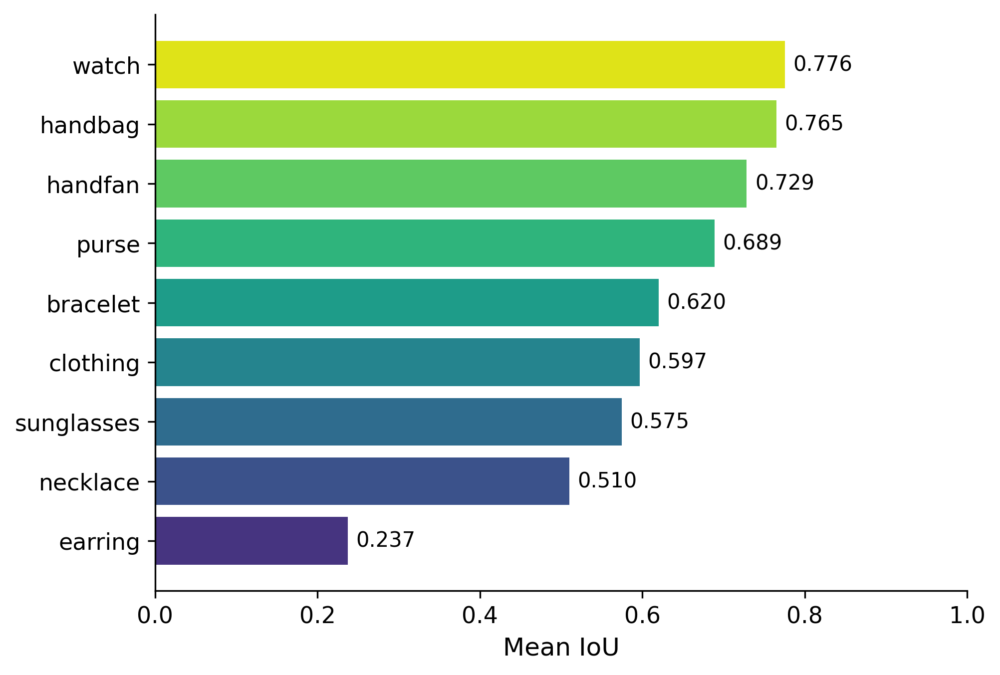
**模型在不同类别上的分割表现差异**

🟢 **表现好的（IoU > 0.7）：** watch（0.776）、handbag（0.765）、handfan（0.729）  
→ 这些都是形状规整、面积较大、边界清晰的物体

🟡 **中等（0.5 ~ 0.7）：** purse、bracelet、clothing、sunglasses、necklace

🔴 **特别差的：** earring（0.237）—— 比第二差的 necklace 还低一半多  
→ 因为耳环极小、常被头发遮挡、和肤色对比弱，模型几乎抓不住


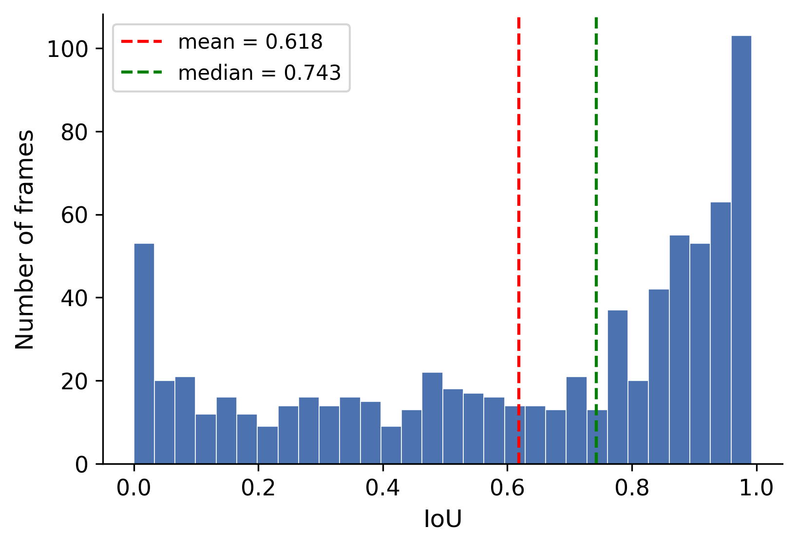


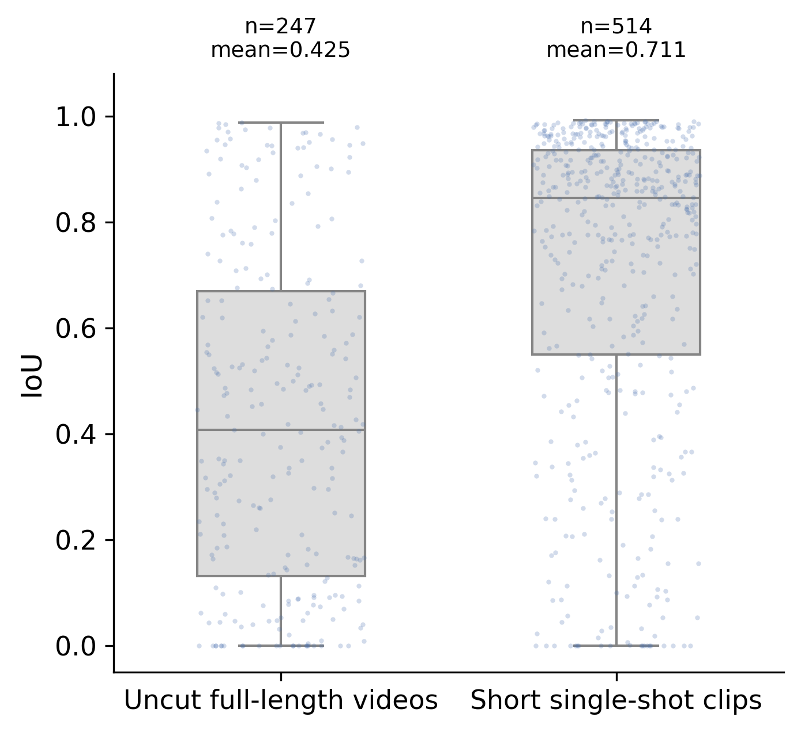


### 4.2 INFER_NO_MASK 失败帧排查（23 帧 → 4 个视频）

全量复现 784 次推理中，23 帧触发 `INFER_NO_MASK`（置信度阈值 0.1 下无任何检测输出）。**全部集中在 4 个视频**，其中 22 帧来自同一商品 `0013-handbag3` 的 3 段 scene：

| 视频 | 类别 | 原 prompt | 失败 / 8 帧 |
|------|------|-----------|------------|
| `0013-handbag3_scene03` | 双肩背包 | `handbag` | **8 / 8** |
| `0013-handbag3_scene02` | 背戴斜挎包 | `handbag` | **8 / 8** |
| `0013-handbag3_scene01` | 背戴斜挎包 | `handbag` | 6 / 8 |
| `0038-necklace5` | 项链 | `necklace` | 1 / 8（仅 frame_04） |

**根因分类（已排除"目标不可见/全程遮挡"）：**

| 根因 | 涉及帧数 | 典型表现 |
|------|---------|---------|
| **Prompt 语义不匹配**（backpack vs handbag） | 8 | scene03 黑色双肩包，`handbag` 全程无输出 |
| **视角/佩戴方式与 prompt 偏差**（背对镜头 + 斜挎） | 14 | scene02 全失败；scene01 同包时成时败 |
| **置信度阈值边界** | 7 | scene01 6 帧 + necklace frame_04（局部遮挡 + 强反光） |

**失败帧抽查（GT 可见，但 SAM3 无输出）：**


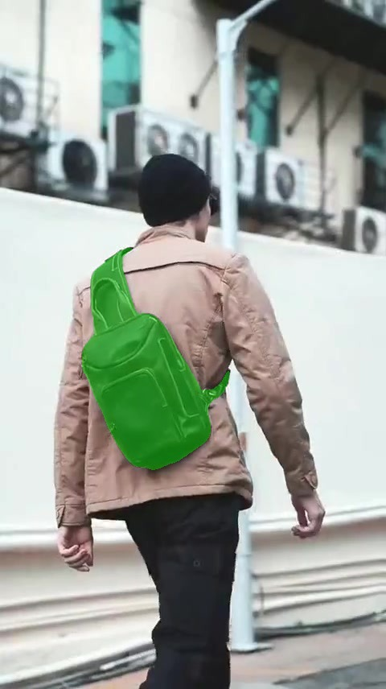

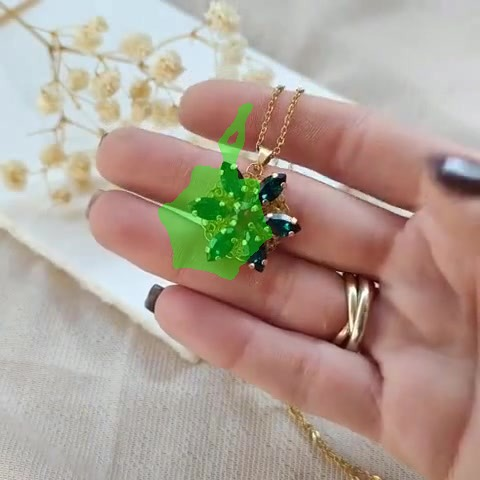

### 4.3 Prompt 修正与定向重跑

**核心调整（仅改 2 类 prompt + 1 处阈值，其余 94 个视频不动）：**

| 视频文件夹 | 原 prompt | 重跑 prompt / 阈值 | 理由 |
|-----------|-----------|-------------------|------|
| `0013-handbag3_scene03/` | `handbag` | **`backpack` @ 0.1** | 目标为双肩背包 |
| `0013-handbag3_scene01/`<br>`0013-handbag3_scene02/` | `handbag` | **`sling bag` @ 0.1**（失败帧 fallback 至 `handbag` @ 0.01） | 背戴斜挎包语义 |
| `0038-necklace5/` | `necklace` @ 0.1 | **`necklace` @ 0.05** | 单帧边界 case，略降阈值即可 |

**整体指标变化（98 视频 × 8 帧 = 784 帧）：**

| 指标 | 原复现 `sam3_pvtt_full` | 重跑后 `no_mask_retry` | 变化 |
|------|-------------------------|------------------------|------|
| 有效帧数 | 761 / 784 | **781 / 784** | **+20 帧** |
| 无 mask 失败帧 | 23（2.93%） | **3（0.38%）** | **−20 帧** |
| Micro mean IoU | 0.6184 | **0.6192** | +0.0008 |
| Micro median IoU | 0.7429 | **0.7486** | +0.0057 |

**4 个涉事视频的 per-video 变化：**

| 视频 | 原成功帧 | 原 mean IoU | 重跑成功帧 | 重跑 mean IoU |
|------|---------|------------|-----------|--------------|
| `0013-handbag3_scene02/` | 0/8 | 0.000 | **8/8** | **0.937** |
| `0013-handbag3_scene03/` | 0/8 | 0.000 | **8/8** | 0.304（mask 全恢复，但 `backpack` 与 GT handbag 区域对齐差） |
| `0013-handbag3_scene01/` | 2/8 | 0.927 | 5/8 | 0.918（仍剩 3 帧失败：极端背视角 + 运动模糊） |
| `0038-necklace5/` | 7/8 | 0.392 | **8/8** | 0.385 |

**重跑后代表性 overlay（Pred = 蓝色，GT = 绿色）：**


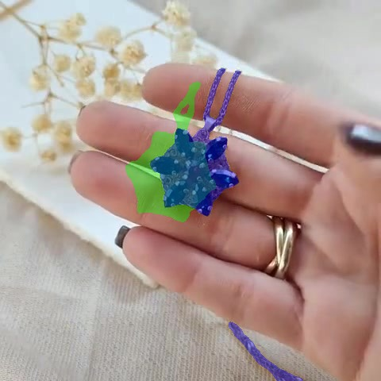

**小结：** 23 帧失败中 **20 帧可通过 prompt 细化或略降阈值恢复**；剩余 **3 帧**（`0013-handbag3_scene01` 的 frame_02/03/05）在现有 prompt 与阈值组合下仍无法产出 mask，需后续引入框提示或 VLM 辅助选词。该排查流程也印证了分割路由 Agent 中 **「品类 prompt 不能仅依赖文件名映射，需结合 VLM 识别具体包型（handbag / sling bag / backpack）」** 的必要性。

## 5. 结论与发现

### 5.1 SAM3 复现结论

1. **关键帧定位整体可用：** 超过半数采样帧 IoU ≥ 0.7，SAM3 可作为完整 VOS 管线中 **关键帧文本定位模块** 的候选后端。
2. **品类分化明显：**
  - **强项（Mean IoU > 0.68）：** 手表（0.776）、手提包（0.765）、折扇（0.729）、钱包（0.689）——目标大、轮廓刚性、对比度高。
  - **弱项（Mean IoU < 0.55）：** 耳环（0.237）、项链（0.510）——目标极小、细链结构、强高光干扰。
  - **中等/分化：** 手镯（0.620）、墨镜（0.575，单 scene 内 0.05–0.94 波动大）、服装（0.597，样本少）。
3. **场景强依赖 scene 切分：** 无 scene 标签的完整长视频关键帧 Mean IoU 仅 **0.425**；有 scene 标签的短镜头可达 **0.85–0.93**。SAM3 更适合在 **经 shot 检测切分后的商品短 clip 的关键帧** 上定位，而非对 raw 长视频稀疏采样后直接当作全视频结果。
4. **与 SAM2 等时序模型的互补关系：** SAM3 的优势在于 **零样本文本定位**（无需首帧点击/框选），适合作为关键帧上的重型推理模块；劣势在于 **本实验未启用视频时序传播**（仅对采样帧做独立图像推理）。在完整分割管线中，预期组合方式为：**SAM3 在关键帧上文本定位 → SAM2/Cutie 等向全视频其余帧传播 mask**，最终输出逐帧 mask 序列。

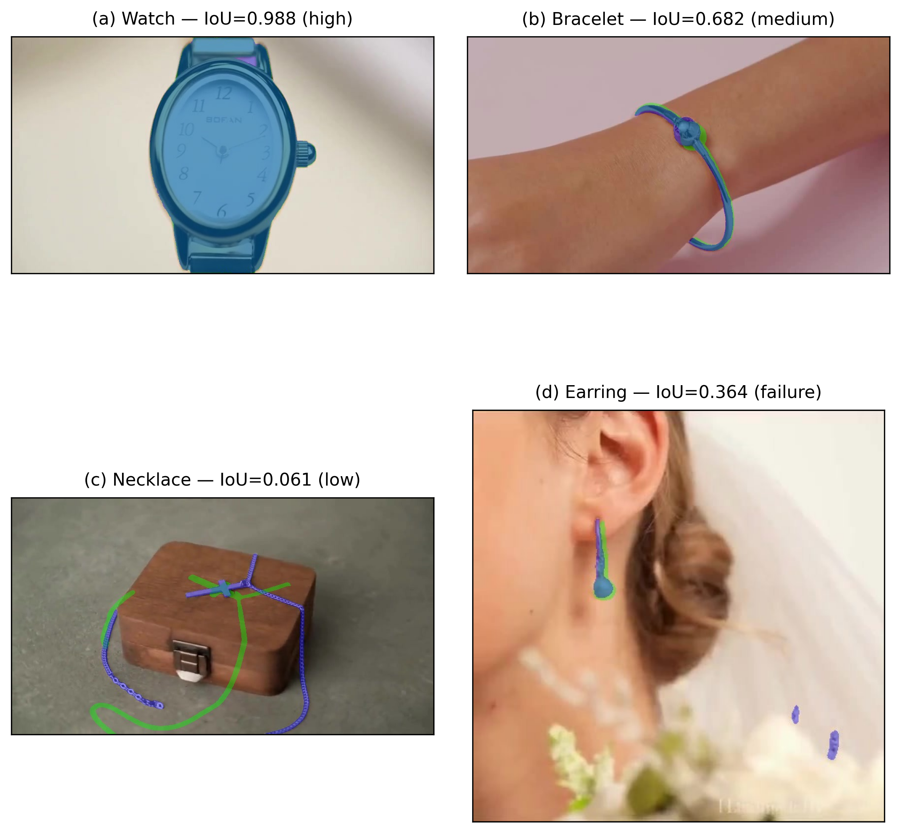

**关于 (c) Necklace 低 IoU 的进一步分析。** 经人工抽查发现，(c) 中 Necklace 案例的低 IoU（0.061）**并非由 SAM3 预测不准确导致，而是源于 GT 标注本身的不准确**。如下方对比图所示，SAM3 实际预测的 mask（蓝色）合理地覆盖了图中真实的项链链条区域，而 GT mask（绿色）的链条走向与实际像素位置存在显著偏移，呈"骨架式"粗略标注。两条细线一旦在空间上错位，IoU 会迅速塌缩至接近 0。这说明 PVTT 数据集在细链类目标上的 GT 质量存在系统性噪声，SAM3 在此类目标上的真实性能可能被现有指标低估。


**关于 "low" 与 "failure" 标签的说明。** 图中 (c) 标注为 "low"、(d) 标注为 "failure"，二者描述的并非同一维度：**"low" 是帧级别（frame-level）描述**，指**该单帧的 IoU 数值偏低**（此处为 0.061）；**"failure" 是品类级别（category-level）描述**，指**该案例所属的品类（Earring）整体属于 SAM3 的失败品类**（Earring 品类 Mean IoU 仅 0.237，为 9 个品类中最差）。因此，"failure" 案例的单帧 IoU（0.364）反而高于 "low" 案例（0.061），这并非矛盾，而是两种粒度的标签共同作用的结果。

### 5.2 五模型横向对比

> **说明：** SAM3 在 PVTT 电商集上仅评测 **关键帧文本定位能力**（每视频抽 8 帧、算 IoU，无全帧时序传播）；其余四模型在 DAVIS 2017 验证集上做 **全视频时序传播**（首帧点/框初始化 → 传播至全部帧，J&F 指标）。二者数据集、推理范围与指标均不同，对比侧重 **能力画像与路由角色分工**，而非直接数值排名。

#### 总体定量（DAVIS 2017，四模型）


| 模型             | J&F ↑     | TC ↑      | ΔArea% ↓ | 核心特点                      |
| -------------- | --------- | --------- | -------- | ------------------------- |
| **SAM2/GSAM2** | **90.87** | 79.44     | 4.41     | 综合最优；遮挡恢复强                |
| **Cutie**      | 88.91     | **79.71** | **4.06** | 时序最稳定                     |
| **DEVA**       | 88.77     | 79.65     | 4.23     | 细小/半透明物体更保守               |
| **XMem**       | 87.18     | 79.66     | 4.24     | 长期记忆；相似物体边界精              |
| **SAM3**（PVTT） | —         | —         | —        | Mean IoU **0.62**；文本零样本定位 |


#### 各模型代表案例与能力画像

**① SAM2/GSAM2 — 大物体 + 遮挡恢复**

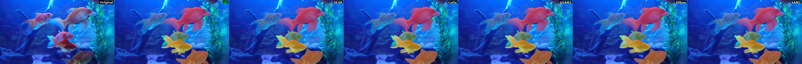

- **擅长：** 大型边界清晰商品（包、鞋、家电）；快速运动遮挡后恢复（bmx-trees J&F=80.0）；多物体场景整体分割。
- **不擅长：** 半透明/边界模糊物体（paragliding 排名垫底）；极细结构（风筝线区域覆盖不足）；记忆膨胀导致 mask 偏大。
- **电商映射：** 静态展示的大件商品、手持大物（整包/整表）。

**② Cutie — 时序一致性优先**

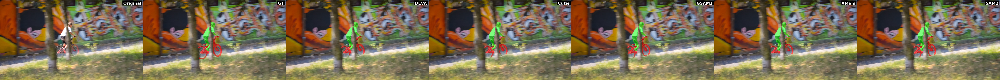

- **擅长：** 长视频时序稳定（仅 27 帧 ΔArea 超标）；多物体 ID 一致性好。
- **不擅长：** 综合 J&F 略低于 SAM2；遮挡剧烈时与其他模型差距不大。
- **电商映射：** 需要 mask 时序平滑的多产品轮播视频；作为 SAM2 结果的 **时序兜底**。

**③ DEVA — 细小/半透明结构**

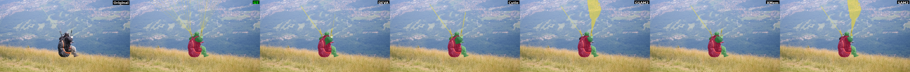

- **擅长：** 半透明、边界模糊物体（降落伞伞面）；细小配件分割更保守、少过分割。
- **不擅长：** 大物体场景略逊 SAM2；综合 J&F 排名第三。
- **电商映射：** 含纱巾、透明包装、细链/吊坠等 **半透明或细结构配件** 的商品。

**④ XMem — 相似物体 + 长期跟踪**

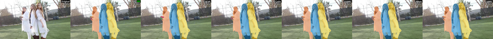

- **擅长：** 外观相似的多目标边界精度；长视频持久 ID 跟踪。
- **不擅长：** 综合 J&F 最低；小物体漏检。
- **电商映射：** 多款相似 SKU 同框展示；需要跨镜头保持同一商品 ID 的长视频。

**⑤ SAM3 — 文本零样本定位（本周新增）**


- **擅长：** 文本 prompt 直接定位，无需人工点击；手表/包/钱包/折扇等 **刚性中等尺寸配饰**（IoU > 0.68）；scene 切分后的短商品镜头（IoU 0.85+）。
- **不擅长：** 极小珠宝（耳环 IoU 0.24）；未切分长视频（IoU 0.43）；**单独使用时无法向全帧传播**（需配合 SAM2/Cutie 等时序模块）。
- **电商映射：** 用户给出自然语言分割指令（如「分割视频里的手表」）时，SAM3 负责 **关键帧上的文本定位**；全视频 mask 由后续时序传播补全，**输出 mask 视频**。

#### 综合对比表


| 模型         | 最佳场景           | 薄弱场景                       | 电商适用品类        | 初始化方式              |
| ---------- | -------------- | -------------------------- | ------------- | ------------------ |
| SAM2/GSAM2 | 大物体、遮挡恢复       | 细线、半透明膨胀                   | 包、鞋、表、家电      | 点/框                |
| Cutie      | 长视频时序稳定        | 绝对精度略低                     | 多产品轮播         | 点/框                |
| DEVA       | 细结构/半透明        | 大物体                        | 首饰链、纱巾、透明包装   | 点/框                |
| XMem       | 相似物/长跟踪        | 综合精度                       | 多 SKU 同框      | 点/框                |
| **SAM3**   | **关键帧文本零样本定位** | **极小珠宝、长 raw 视频；不能单独全帧传播** | **表、包、钱包、折扇** | **文本 prompt（关键帧）** |


### 5.3 分割路由逻辑（草案）

基于本周实验，后续 **分割路由 Agent** 的 VOS 管线需明确：**所有帧最终都要有 mask**；路由决定的是各模块的分工，而非跳过某些帧。管线输出为 **mask 视频**，不包含编辑/替换步骤。

```
用户指令 + 视频输入
        │
        ▼
┌──────────────────────────────────────────┐
│  Layer 1: VLM 场景理解（首帧/关键帧）       │
│  输出: 品类 / 尺度 / 交互类型 /            │
│        是否已切分 scene / 建议传播后端      │
└──────────────────┬───────────────────────┘
                   │
                   ▼
┌──────────────────────────────────────────┐
│  Layer 2: 关键帧检测 + 分割后端选择         │
│  （"动态采样"= 关键帧触发频率自适应）        │
│                                           │
│  平稳段: 大间隔关键帧 → 重型推理            │
│  剧变/遮挡段: 缩短间隔 → 触发重检测         │
│                                           │
│  关键帧上的重型推理路由:                    │
│    有文本目标 → SAM3 文本定位              │
│    无文本/需精框 → SAM2 点/框初始化         │
│    细结构品类 → DEVA 优先                  │
│    多相似 SKU → XMem 优先                  │
│                                           │
│  视频形态:                                 │
│    未切分长视频 → 先 shot 检测再分段处理    │
│    scene 短 clip → 首帧定位 + 全帧传播      │
└──────────────────┬───────────────────────┘
                   │
                   ▼
┌──────────────────────────────────────────┐
│  Layer 3: 全帧时序传播 + 质量兜底           │
│  （关键帧 mask → 传播至所有中间帧）          │
│                                           │
│  默认: SAM2/Cutie/DEVA/XMem 传播全视频     │
│  时序抖动大 → Cutie fallback 重传播        │
│  传播跟丢 → 插入新关键帧 + VLM 重识别       │
│  → 最终输出: 每一帧均有 mask               │
└──────────────────────────────────────────┘
```

**关键路由规则：**


| 条件                  | 路由目标                           | 依据                                  |
| ------------------- | ------------------------------ | ----------------------------------- |
| 用户给出文本目标（"分割手表"）    | 关键帧 SAM3 定位 → 全帧 SAM2/Cutie 传播 | SAM3 负责文本零样本定位；时序模块负责全帧覆盖           |
| 品类 = 耳环/项链/手镯（细结构）  | 关键帧 DEVA 或 SAM3+框提示 → 时序传播     | SAM3 耳环 IoU 0.24；DEVA 细结构更保守        |
| 品类 = 手表/包/钱包（大刚性）   | 关键帧 SAM3 定位 → 时序传播             | PVTT 上关键帧 Mean IoU > 0.68           |
| 视频无 scene 标签（长 raw） | 先 shot 检测分段，再各段走关键帧+传播         | 长视频关键帧 IoU 0.43 vs scene clip 0.85+ |
| 多相似商品同框             | XMem 做全帧传播                     | lab-coat 场景 F 值最高                   |
| 手持/遮挡/快速运动          | 缩短关键帧间隔 + SAM2 传播              | bmx-trees 遮挡恢复最优；剧变期需更频繁重检测         |
| 时序 mask 抖动          | Cutie 接管传播                     | ΔArea% 最低（4.06%）                    |


### 5.4 踩坑记录

1. **PVTT mask 为灰度非二值：** `masks/` 下约 70 级灰度，评测时需阈值化（>0），否则 IoU 偏低。
2. **SAM3 无 mask 输出：** 23 个采样帧 `INFER_NO_MASK` 失败（2.93%），集中在特定手提包 scene 与墨镜长视频。
3. **本次评测非全帧推理：** 每视频仅均匀抽 8 帧跑 SAM3，目的是节省算力并快速摸底关键帧定位效果；**不能据此推断接入时序传播后的全视频 J&F**。长 raw 视频的 8 帧采样与 GT 还存在时间对齐误差，IoU 0.43 可视作 **关键帧精度下界**。
4. **指标与推理范围不可直接横比：** DAVIS 四模型做全帧时序传播（J&F）；SAM3 仅评关键帧定位（IoU）。分割路由设计应明确 **关键帧模块 vs 传播模块** 的分工，而非追求单一模型全覆盖。

## 6. 下周计划

- **分割路由 Agent 架构文献调研：** 精读 3–5 篇多工具 Agent 论文（ReAct、Plan-and-Solve 等），重点梳理「VLM 规划 → 工具调用 → 结果验证」范式在 **分割任务编排** 中的可借鉴之处，输出 1 页调研笔记。
- **分割 Agent 原型搭建（MVP）：** 基于 LangGraph 或类似框架搭建最小 Agent，定义 4 个 Tool 接口（`segment_by_text` → SAM3 关键帧定位、`propagate_mask` → SAM2/Cutie 全帧传播、`detect_shots` → scene 切分、`eval_motion` → 剧变检测触发重检测），在 5 个 PVTT 样例视频上跑通「文本指令 → 关键帧定位 → 全帧传播 → **输出 mask 视频**」闭环。
- **VLM 路由模块初测：** 接入 Qwen-VL，设计 Prompt 让 VLM 对电商视频首帧输出 `{品类, 尺度, 交互类型, 是否有 scene}` 四元组，在 PVTT 98 视频上统计路由准确率，验证 Layer 1 决策的可行性。

---

## 附录

### A. SAM3 复现产出路径


| 内容          | 路径                                                          |
| ----------- | ----------------------------------------------------------- |
| 全量实验报告      | `sam3/sam3_pvtt_full/SAM3_PVTT_Full_Reproduction_Report.md` |
| 数据集分析       | `sam3/sam3_pvtt_demo/DATASET_REPORT.md`                     |
| IoU 汇总      | `/data/liuluyan/sam3/sam3_pvtt_full/iou_summary.csv`        |
| 可视化 overlay | `/data/liuluyan/sam3/sam3_pvtt_full/overlays/`              |
| 推理脚本        | `/data/liuluyan/sam3/sam3_pvtt_full/infer_pvtt_full.py`     |


### B. 前期四模型评测参考

- 详细报告：`weekly_report/week5_report.md`
- DAVIS 对比图：`davis2017_comparison/`
- 评估脚本：`python scripts/eval_segmentation.py`

### C. SAM3 按品类 Mean IoU 速查


| 品类  | Mean IoU | 评级    |
| --- | -------- | ----- |
| 手表  | 0.776    | ★★★★★ |
| 手提包 | 0.765    | ★★★★★ |
| 折扇  | 0.729    | ★★★★  |
| 钱包  | 0.689    | ★★★★  |
| 手镯  | 0.620    | ★★★   |
| 服装  | 0.597    | ★★★   |
| 墨镜  | 0.575    | ★★★   |
| 项链  | 0.510    | ★★    |
| 耳环  | 0.237    | ★     |


